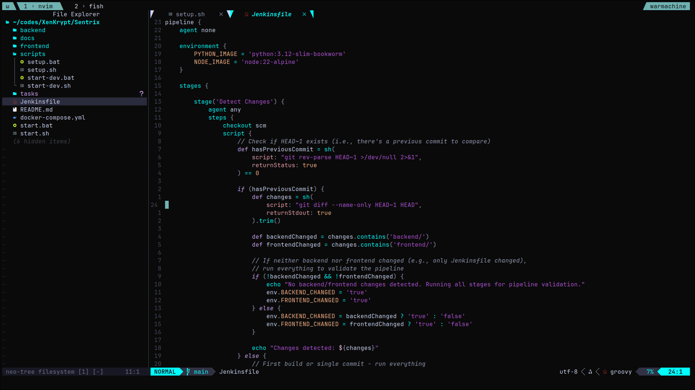

# ShowCasing Arpan's desktop

---

---
A comprehensive collection of my desktop environment configurations, featuring a cohesive teel blue (`#00FFFF`) theme across all applications.

## 🚀 Features

- **Consistent Mint Green Theme** across all applications
- **Hyprland** window manager configuration
- **Neovim** setup with LazyVim package manager
- **Fish shell** with custom configurations
- **Alacritty** terminal emulator
- **Starship** cross-shell prompt
- **Rofi** application launcher and menus
- **Waybar** customizable status bar
- **Multiple desktop environment support** (Hyprland, Qtile)

## 🎨 Color Scheme

The entire setup uses a consistent mint green color palette:
- Primary: `$00FFFF` (Teel blue)
- Background: `#282c34` (Dark)
- Foreground: `#bbc2cf` (Light Gray)
